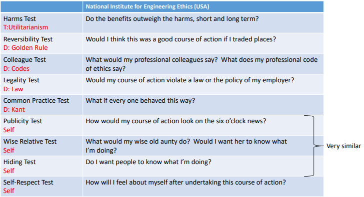

#Lecture
## Requirements of a professional engineer
- Able to identify the different and potentially competing ethical concerns they may face
- Able to analyse the issues that might underlie those concerns
- Respond effectively to those concerns. 
From royal academy of Engineering: *Engineering Ethics in practice*

## Ethics topic coverage
- Understanding the requirements of professional code of conduct
- Personal and workplace integrity 
- sustainability obligation
- whistle-blowing
- dealing with safety and risks
- Liability issues
- conflict of interests
- multinational operations
- privacy
## Ethics: The Study of Moral Principles
- what ***ought*** to be done
- What character a person ***ought*** to be
- What values and morals a person ***ought*** to adopt
### Factors influencing ethics in the workplace
- [[1. Thinking Ethically#The Person|The Person]]
- [[1. Thinking Ethically#The Environment|The Environment]]
- [[1. Thinking Ethically#The Organisation| The Organisation]]
![[Pasted image 20230904122305.png|400]]

### The Person 
- **ethical values**
- Directly relate to personal beliefs
- **Non ethical values**
- Ethically **neutral**
- Relate not to **Morality** but to **desire**
- Pursuing non-ethical values is not wrong. **AS LONG** as it does not violate ethical values
### The Environment
**Ethics and the Law**
- Ethics: what a person ***ought*** to do
- Law: what a person is required to do by the state
	- Differs from country to country
- Law establishes **minimum standards of conduct**
	- Actions can be legal but not ethical
- Laws evolve with culture
### The Organisation 
**EngNZ Code of Ethical Conduct**
“The Code of Ethical Conduct sets out your  duty to the public and to each other when  you undertake engineering activities.  It gives you a decision‐making framework  for professional behaviour and is the  backbone of what it means to be a  professional engineer in New Zealand.”
![[Pasted image 20230904123614.png|200]]
## What makes actions right or wrong

### [[Rule-Based thinking (Deontology)]]
**Absolutist**
- The belief that an act can be judged moral if it is the right thing to do, regardless of the consequences
- **Do the right thing**
### [[Ends‐Based Thinking (Teleology)]] 
**Flexible**
- The belief that an act can be judged moral or immoral depending on its **consequences**
- **Do the most good (the ends justifies the means)**
### [[Virtues‐Based Thinking]]
**Absolutist**
- The belief that an act can be judged moral if the intent of the does is to act as a virtuous person
- **Be a good person**
### The “Prima Facie” Duties Framework
- Fidelity
	- Keep promises and don't tell lies
-  Reparation
	- fix wrong doings
- Gratitude
	- be grateful to parents and benefactors
- Justice
	- Beyond the letter of the law
- Beneficence 
	- Do good if you can
- Self-improvement 
	- Act in a way that promotes your own self interest
- Non-maleficence
	- Do not injure/hurt others (Mentally, Physically etc)\
### Weinstein’s Five Ethical Principles
- Do no harm
	- Prevent harm
- Make things better
- Respect others
- Be fair
- Be compassionate
### Tests for Evaluating Actions
![[Pasted image 20230908111544.png]]

# Flashcards

## Requirements of a Professional Engineer

**Able to identify different ethical concerns** ::: Recognize various ethical issues.

**Able to analyze underlying issues** ::: Understand the reasons behind ethical concerns.

**Respond effectively to those concerns** ::: Act appropriately in response to ethical concerns.

## Ethics Topic Coverage

**Understanding professional code of conduct** ::: Knowing the rules of professional behavior.

**Personal and workplace integrity** ::: Maintaining honesty and ethical behavior at work.

**Sustainability obligation** ::: Responsibilities towards environmental sustainability.

**Whistle-blowing** ::: Reporting unethical behavior within the organization.

**Dealing with safety and risks** ::: Handling safety concerns and risks responsibly.

**Liability issues** ::: Understanding legal responsibilities.

**Conflict of interests** ::: Managing situations where personal interests conflict with professional duties.

**Multinational operations** ::: Dealing with ethical issues in international contexts.
<!--SR:!2023-09-13,3,250-->

**Privacy** ::: Respecting and safeguarding personal information.

## Ethics: The Study of Moral Principles

**Ethics: What ought to be done** ::: Determining what actions are morally right.

**What character a person ought to be** ::: Identifying the qualities and values a person should have.
<!--SR:!2023-09-13,3,250-->

**What values and morals a person ought to adopt** ::: Deciding on the ethical values and principles to follow.

## Factors Influencing Ethics in the Workplace

**The Person** ::: Individual values and beliefs.

**The Environment** ::: Legal and cultural factors.

**The Organisation** ::: Workplace policies and codes of conduct.

## What Makes Actions Right or Wrong

**Rule-Based Thinking (Deontology)** ::: Doing the right thing regardless of consequences.

**Ends‐Based Thinking (Teleology)** ::: Judging actions based on their consequences.

**Virtues‐Based Thinking** ::: Judging actions based on the intent to act virtuously.

## The “Prima Facie” Duties Framework

- **Fidelity** ::: Keeping promises and telling the truth.
- **Reparation** ::: Fixing wrongdoings.
- **Gratitude** ::: Being thankful to parents and benefactors.
- **Justice** ::: Going beyond the letter of the law.
- **Beneficence** ::: Doing good if possible.
- **Self-improvement** ::: Promoting one's self-interest.
- **Non-maleficence** ::: Avoiding harm to others.

## Weinstein’s Five Ethical Principles

- **Do no harm** ::: Preventing harm.
- **Make things better** ::: Improving situations.
- **Respect others** ::: Treating others with respect.
- **Be fair** ::: Acting fairly.
- **Be compassionate** ::: Showing compassion.

## Tests for Evaluating Actions

### Flashcards

**Rule-Based Thinking; Definition and Absolute or Flexible** ::: Do the right thing always, Deontology - Absolutist

**Ends-Based Thinking; Definition and Absolute or Flexible** ::: Do the Most good, Teleology - Flexible

**Virtues-Based Thinking; Definition and Absolute or Flexible** ::: Be a good person - Absolutist